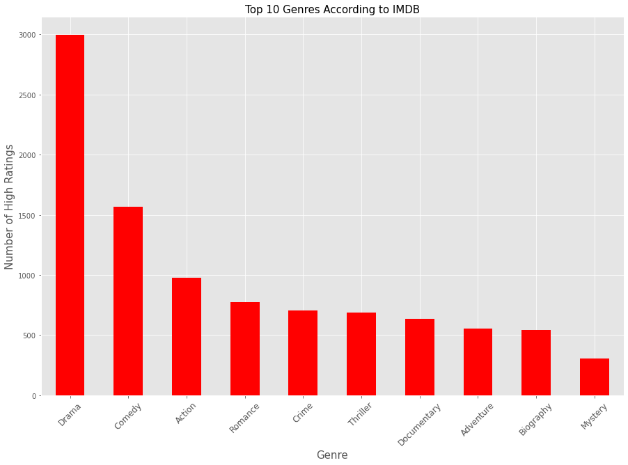

MICROSOFT MOVIE STUDIO PROJECT

OVERVIEW

Microsoft has enlisted my services as a data scientist to help them identify which movies are doing best at the box office, since the creation of their new movie studio.My task will be to go through available resources like the IMDb database and Box Office Mojo dataset, this will enable me to figure out which movies have performed the best depending on various factors such as total gross revenue of the movie and its rating. The results attained will enable the Microsoft movie studio to know which genres of movies and other factors might influence the performance of their movie in the box office, hence allowing them to make a well informed choice on which type of films they want to make .

BUSINESS UNDERSTANDING

Understanding what movies have made the highest gross  worldwide, have the highest rating amongst fans and critics alike and the most popular genres from a profitability and review standpoint will provide Microsoft with the insight to direct resources to creating the best content possible.

DATA UNDERSTANDING

IMDB is one of the largest database for information relating to movies and TV series that includes information about the cast, crew, plot summaries, rating and reviews both critcal and fan-based. Each review has a unique ID associated to the movie details and the ratings. The data files provides information on the studio that created the movie, the running time, the year it was released and genre.

Box Office Mojo provides the lifetime highest gross movies and this dataset has been restricted from 2010 to present. This information will be useful to find the top grossing movies and insights we can make from why they are the top gross movies.

The Numbers provides comprehensive records spanning from 1915 to 2020, detailing production budgets, domestic, and worldwide gross box office figures. 

3.DATA ANALYSIS

To ensure quality of our analysis the data had to be cleaned.This entailed removing rows with null values and outliers and replacing other null values in columns:

The above graphs show relationship between the domestic and foreign gross

The graph shows the most common genres with the highest ratings

CONCLUSIONS:

Focus on making films that are a combination of Drama, comedy and action. 

Make the movie somewhere within 120-150 minutes long since movies in this range tend to make the most net profit on average with the most consistency.

Analysis shows that spending a minimum of 80 million dollars will have a high chance of bringing back a positive return on investment

RECOMMENDATION

Look at reviews as they shed light on aspects like storytelling, acting, directing, or unique elements that resonated with critics.

Focus on story and execution as they are more crucial for a movie's success than just a high budget.

Consider the genre and target audience.

If a specific language consistently shows higher popularity, consider prioritizing co-productions or films in that language. For example english.

Further data and analysis can help Microsoft narrow down their decision making.

Marketing plays a big part in movie sucess. Examing this data could give insights on how audiences respond to different marketing techniques when promoting a movie.

 With the growth of streaming services, we can look at these other forms of revenue to help with decision making.